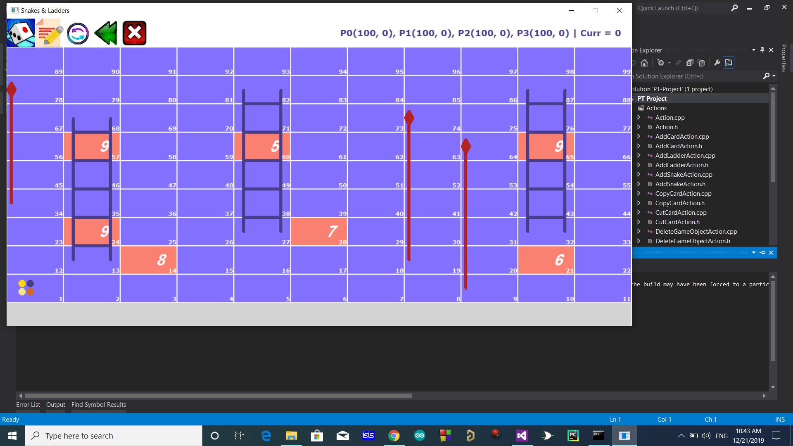

<h1 align="center">
  Jungle Run
</h1>

# Overview

A Ladder & Snake game enhanced with Monoply-like features. It is implemented in C++ depending on OOP paradigm. Some of the Monopoly features included are cards for punishing and rewarding players.

# Features

## Design Mode Operations

  <b>An example of a simple level shown in the Design mode</b>

 

The purpose of this mode is to design the Grid of the game that you will play later. You specify in this mode the location of the snakes, ladders, and cards. You also specify each cards needed values. Supported Operations are:

- Add Ladder & Add Snake
- Add Card & Edit Card
- Copy, Cut & Paste Card
- Delete Game Object
- Save & Open Grid
- Switching between Play mode & Design mode

## Play Mode Operations

  <b>An example of a simple level shown in the Play mode</b>

 

Supported Operations are:

- Roll Dice
- Manually Input Dice Value
- New Game

## Special Attacks

Each player has 4 special attacks that he can use throughout the game. A player can choose during his “recharge the wallet” turn to launch a special attack instead of recharging his wallet. Attacks are:

- Ice: Choose a player to prevent from rolling the next turn.
- Fire: Choose a player to burn. Deduct 20 coins from his wallet for his next 3 turns (total 60).
- Poison: Choose a player to poison. For 5 turns, deduct 1 number from his dice roll.
- Lightning: Deduct 20 coins from all other players.

## Game Logic

  <b>An example of a level with some shown cards</b>

 

This includes handling:

- Player movement
- Adding money after 3 turns
- Taking Ladders & Snakes
- Cards:
  - Card 1 & 2: Decrements/Increments the value of the passing player’s wallet.
  - Card 3 & 4: Moves the player forward to the start of the next ladder/snake.
  - Card 5 & 6: Move forward/backward the same number of steps that you just rolled.
  - Card 7: Extra dice roll.
  - Card 8: Prevent next dice roll.
  - Card 9: Instructs the player to go to a specific cell specified during grid design.
  - Cards [10-14]: Monopoly like cells, i.e. buy cells to make them stations and get rent from passing players.
